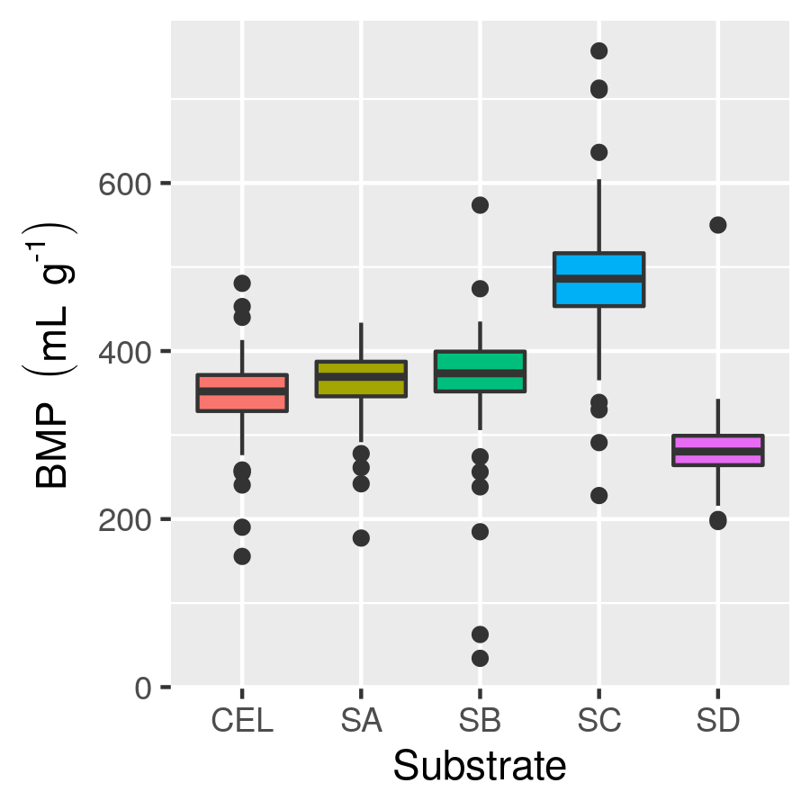

# BMP-data
Laboratory data from biochemical methane potential (BMP) tests.
Version 0.1.

# Quick start
To get everything, select the green "clone or download" button above, and then "download ZIP'.
Extract the downloaded file.

# Summary
* The purpose of this repository is to share data from BMP tests.
* Available data include BMP measurements from a large number of tests and specific methane production (cumulative yield) from a smaller number of tests.
* New data are added over time.
* BMP data are in the file data/BMP.csv, and SMP in SMP.csv, and header\_info.csv describes the file headers.
* For example scripts, see the scripts directory.  
